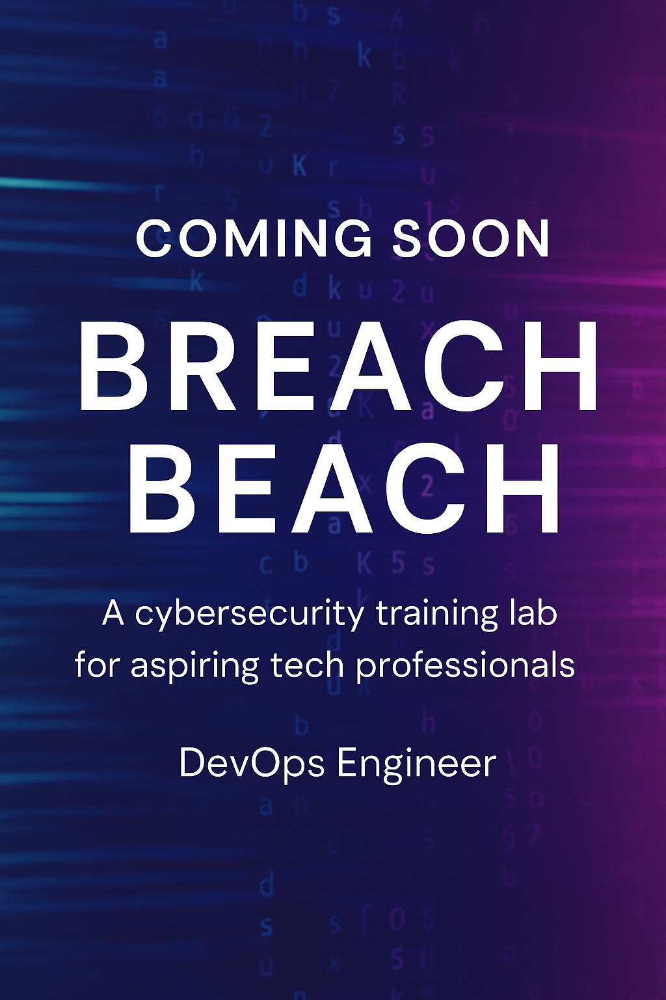

# hjoybelton-portfolio# 
Hasina Joy Belton's – Technical Portfolio

Hi, I’m Joy – a tech-savvy creative with a background in risk analysis, freelancing, and hands-on projects in cloud security, AI, and automation. I’m currently freelancing and participating in fellowships focused on cybersecurity and cloud innovation.

## 💰 Personal Finance Tracker
**Role:** Python Developer  
**Tech:** Python, Pandas, CSV  
**Overview:** Designed and built a personal finance tracker using Python. It allows users to record expenses, categorize spending, and generate summaries for budgeting or tax prep.  
**Skills Demonstrated:**  
- Used dictionaries and tuples to store categorized financial data  
- Implemented input validation and loops for user-friendly CLI  
- Modularized logic into functions (`add_expense`, `view_summary`, etc.)  
- Applied exception handling (`try/except`) for real-world inputs  
- Created printable summaries for freelance/self-employment use  
**📁 [GitHub Repo](https://github.com/Sinajoy23/python-capstone-finance-tracker)**

## Breach Beach Security Lab (Coming Soon)
**Role:** DevOps + Security Lead  
**Tech:** AWS, Terraform, GuardDuty, CloudTrail, GitHub Actions  
**Overview:** Building a cloud-based security training lab to simulate real-world attacks using AWS services.  
**Status:** In Progress (Sprint 3)  
**Planned Features:**  
- VPC + subnet segmentation  
- WAF + API Gateway protection  
- Infrastructure as Code (Terraform)  
- CI/CD pipeline with GitHub Actions  

  
  

## AI Text Completion App
**Role:** Python Dev + AI Integrator  
**Tech:** Python, OpenAI API (GPT-3.5), Flask  
**Overview:** Built a lightweight text-generation app that accepts user prompts and returns AI-powered completions using OpenAI's API. Originally attempted to use Hugging Face models, but pivoted to OpenAI due to deployment/API limitations — demonstrating adaptability.  
**Skills Demonstrated:**  
- Secure API key handling using `.env` files and `python-dotenv`  
- Prompt engineering with OpenAI GPT-3.5  
- Flask-based form submission and JSON response handling  
**📁 [GitHub Repo](https://github.com/Sinajoy23/ai-text-completion-project)**  
⚠️ *Note: API key is hidden for security. Requires OpenAI API key to run locally.*

## My First Security Homelab Write-Up
**Role:** Solo Project  
**Tech:** Mac Mini, Wireshark, Snort, Kali Linux, VM Isolation  
**Overview:** Designed and implemented a personal homelab for learning Blue Team and Red Team skills.  
**Highlights:**  
- Configured IDS/IPS with Snort  
- Simulated brute-force attacks with Hydra  
- Captured packets using Wireshark  
- Hardened Linux environment   
**📄 [View Write-Up](#)** ← *You’ll update this link soon*

---

## 📬 Contact  
- ✉️ Email: hasinajoybelton@gmail.com  
- 🌐 GitHub: [github.com/Sinajoy23](https://github.com/Sinajoy23)  
- 🔗 LinkedIn: [linkedin.com/in/hjoybelton](https://linkedin.com/in/hjoybelton)

---

##  Skills Snapshot  
**Cloud:** AWS, Terraform, IAM, S3, CloudTrail  
**Dev:** Python, Flask, HTML, CSS, JavaScript  
**Security:** IDS/IPS, Packet Analysis, Linux Hardening  
**AI/ML:** Hugging Face, Prompt Engineering  
**Tools:** GitHub, VS Code, Jupyter, QuickBooks, Google Workspace  
